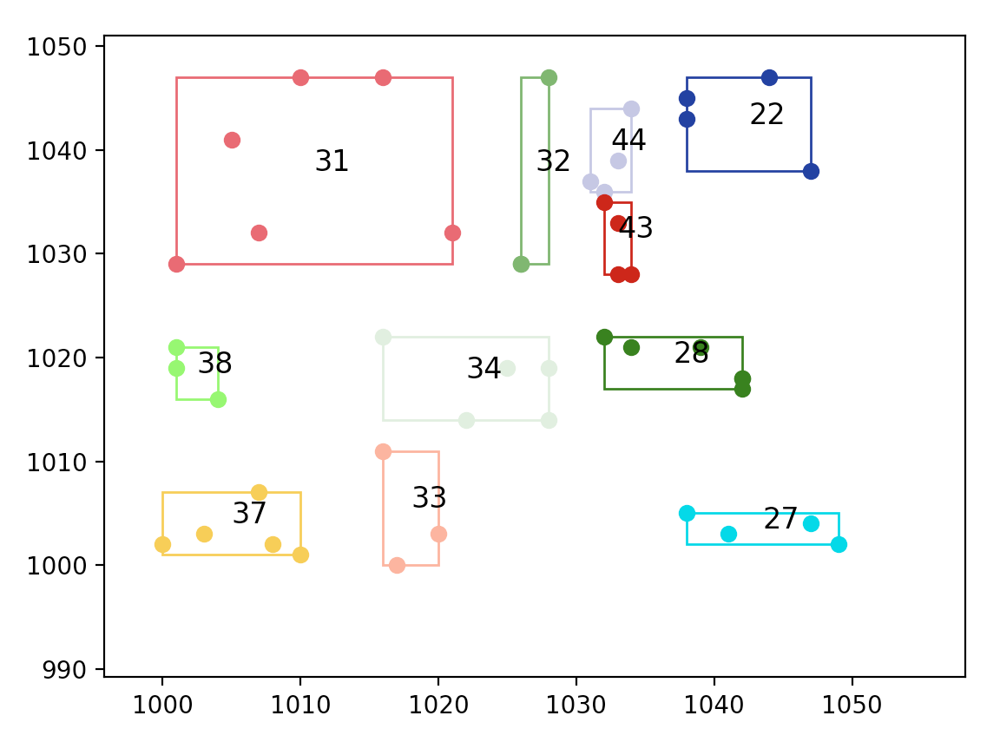

My terrible first ever project in C, with C++ for testing.

# What?
Split points into bounding boxes for easy searching.

# Why?
Because it makes geospatial operations (e.g. nearest neighbour) _fast_.
